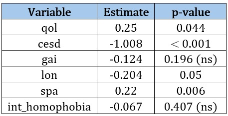
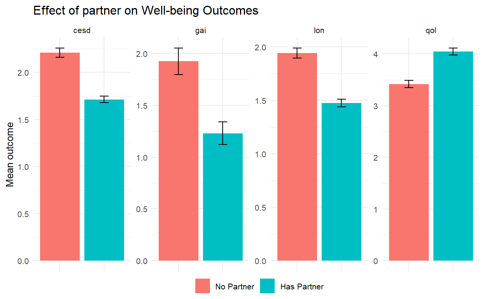
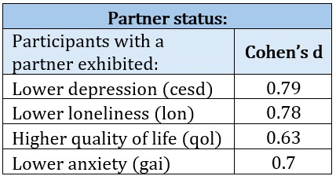
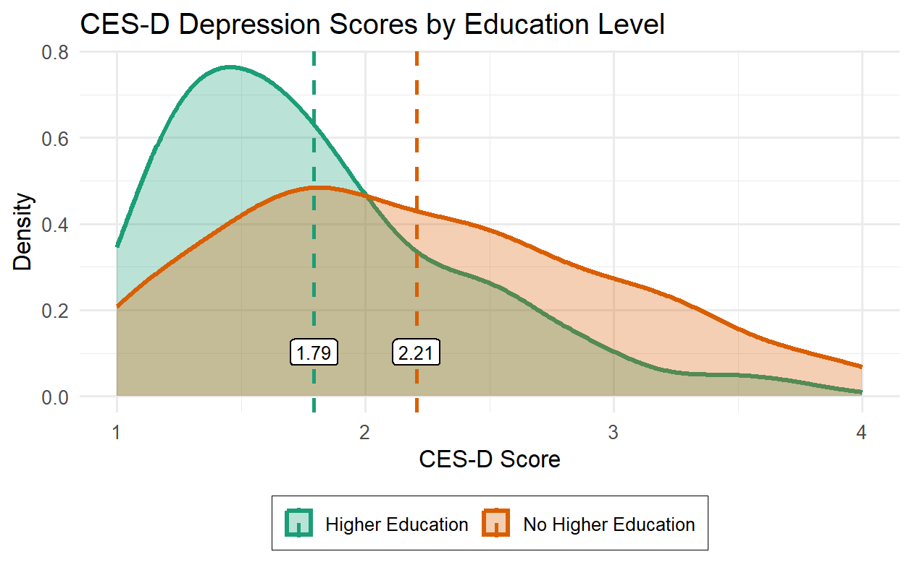
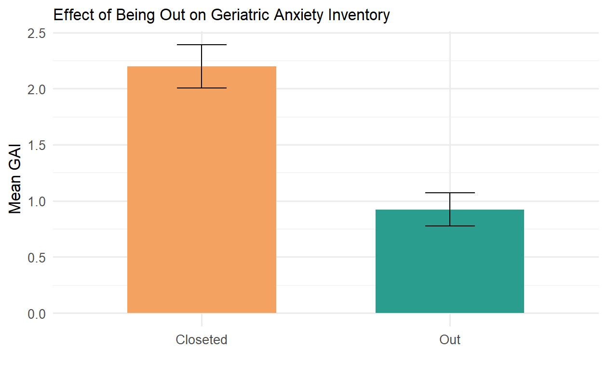
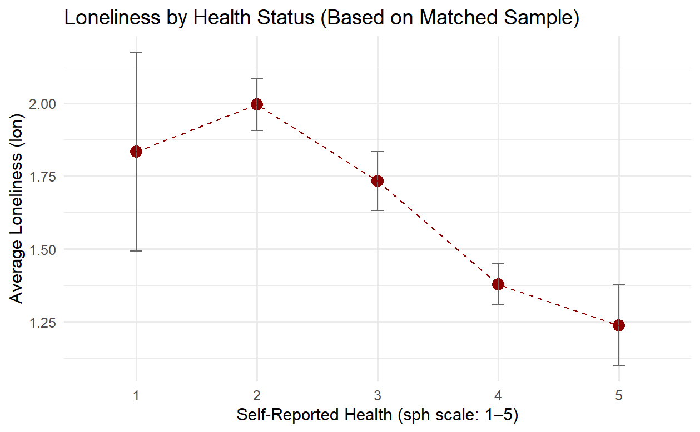

Mental Health and Well-Being of Older LGBTQ+ Adults in Israel
================
Team number 10

- [Environment Setup](#environment-setup)
  - [Load Libraries](#load-libraries)
  - [Read Table](#read-table)
    - [Read survey results table](#read-survey-results-table)
    - [Data Preprocessing](#data-preprocessing)
- [Data Analyzing](#data-analyzing)
  - [Linear Regression Model](#linear-regression-model)
  - [Matching](#matching)
  - [Plots](#plots)
    - [Partnership and Mental Health](#partnership-and-mental-health)
    - [Educational Attainment and Depression
      Risk](#educational-attainment-and-depression-risk)
    - [Outness and Anxiety Among Older LGBTQ+
      Adults](#outness-and-anxiety-among-older-lgbtq-adults)
    - [Loneliness Across Self-Perceived Health
      Levels](#loneliness-across-self-perceived-health-levels)

# Environment Setup

## Load Libraries

``` r
library(knitr)
library(tidyverse)
library(broom)
library(htmltools)
library(haven)
library(tidymodels)
library(glmnet)
library(dplyr)
library(yardstick)
library(MatchIt)
library(stats)
library(effsize)  # For Cohen's d measure
```

## Read Table

The dataset used in this project contains sensitive information from a
survey of older LGBTQ+ adults in Israel and is **not publicly
available** due to ethical and privacy constraints. The survey was conducted between January and August
2023, and was provided by Dr. Ella Cohn-Schwartz at Ben-Gurion University. If you wish to access
the dataset for academic purposes, you may contact the data owner
directly. To reproduce this analysis with your own data, please follow
the structure and format described in the `code/` directory and place
your data in a folder named `data/` as explained below.

> **Note**  
> You should place the data in the root directory of the project under a
> folder named data. Ensure the file name matches exactly, or update the
> path in the scripts accordingly.

    project/
    ├── data/
    │   └── data_toshare.csv
    ├── figures/
    ├── final_project.Rmd
    ├── README.md
    └── .gitignore

### Read survey results table

``` r
data <- read.csv("data/data_toshare.csv")
```

### Data Preprocessing

``` r
# Filter valid responses
data <- data %>% filter(Progress == 100 & lang == 0 & !is.na(age) & age <=75 & !is.na(bio_qlt))

data <- data %>% 
  mutate(sp_gender = replace_na(sp_gender, 0))
data <- data %>% 
  mutate(orient = replace_na(orient, 5))

# Drop unnecessary metadata and helper variables
data <- data %>% filter(!is.na(marit) & marit != 7)
data <- data %>% select(-ResponseId, -Progress, -lang, -sday, -smonth, -syear, -age2, -gnd_age, -add, -choice_fampar, -choice_famex, -choice_coparent, -choice_cnt, -choice_lgbt, -choice_suprec, -choice_supgv, -choice_num_nopartner, -choice_close, -choice_neg, -choice_acc, -choice_comm, -choice_stable, -choice_qlt, -lost_mum, -lost_dad, -lost_child, -lost_sib, -lost_other, -friends_num, -friends_nochoice_num)

# NAs were replaced with median, mode or average based on the distribution and nature of the data in the column
data <- data %>%
  mutate(
    bio_cnt = if_else(is.na(bio_cnt), median(bio_cnt, na.rm = TRUE), bio_cnt),
    bio_close = if_else(is.na(bio_close), median(bio_close, na.rm = TRUE), bio_close),
    bio_acc = if_else(is.na(bio_acc), mean(bio_acc, na.rm = TRUE), bio_acc),
    bio_comm  = if_else(is.na(bio_comm), mean(bio_comm, na.rm = TRUE), bio_comm),
    bio_stable = if_else(is.na(bio_stable), mean(bio_stable, na.rm = TRUE), bio_stable),
    bio_neg = if_else(is.na(bio_neg), median(bio_neg, na.rm = TRUE), bio_neg),
    bio_lgbt = if_else(is.na(bio_lgbt), median(bio_lgbt, na.rm = TRUE), bio_lgbt),
    bio_suprec = if_else(is.na(bio_suprec), median(bio_suprec, na.rm = TRUE), bio_suprec),
    bio_supgv = if_else(is.na(bio_supgv), median(bio_supgv, na.rm = TRUE), bio_supgv),
    bio_close_num = if_else(is.na(bio_close_num), median(bio_close_num, na.rm = TRUE), bio_close_num),
    sp_close = replace_na(sp_close, 0),
    sp_neg = replace_na(sp_neg, 0),
    sp_acc = replace_na(sp_acc, 0),
    sp_comm = replace_na(sp_comm, 0),
    sp_stable = replace_na(sp_stable, 0),
    sp_qlt = replace_na(sp_qlt, 0),
    sp_suprec = replace_na(sp_suprec, 0),
    sp_supgv = replace_na(sp_supgv, 0),
    choice_num = if_else(is.na(choice_num),   median(choice_num, na.rm = TRUE),   choice_num),
    qol_1 = if_else(is.na(qol_1), median(qol_1, na.rm = TRUE), qol_1),
    qol_2 = if_else(is.na(qol_2), median(qol_2, na.rm = TRUE), qol_2),
    qol_3 = if_else(is.na(qol_3), median(qol_3, na.rm = TRUE), qol_3),
    qol_4 = if_else(is.na(qol_4), median(qol_4, na.rm = TRUE), qol_4),
    qol_5 = if_else(is.na(qol_5), median(qol_5, na.rm = TRUE), qol_5),
    qol = if_else(is.na(qol), median(qol, na.rm = TRUE), qol),
    lifesat = if_else(is.na(lifesat), median(lifesat, na.rm = TRUE), lifesat),
    cesd_1 = if_else(is.na(cesd_1), median(cesd_1, na.rm = TRUE), cesd_1),
    cesd_2 = if_else(is.na(cesd_2), median(cesd_2, na.rm = TRUE), cesd_2),
    cesd_3 = if_else(is.na(cesd_3), median(cesd_3, na.rm = TRUE), cesd_3),
    cesd_4 = if_else(is.na(cesd_4), median(cesd_4, na.rm = TRUE), cesd_4),
    cesd_5 = if_else(is.na(cesd_5), median(cesd_5, na.rm = TRUE), cesd_5),
    cesd_6 = if_else(is.na(cesd_6), median(cesd_6, na.rm = TRUE), cesd_6),
    cesd_7 = if_else(is.na(cesd_7), median(cesd_7, na.rm = TRUE), cesd_7),
    cesd_8 = if_else(is.na(cesd_8), median(cesd_8, na.rm = TRUE), cesd_8),
    cesd = if_else(is.na(cesd), median(cesd, na.rm = TRUE), cesd),
    gai_1 = if_else(is.na(gai_1), median(gai_1, na.rm = TRUE), gai_1),
    gai_2 = if_else(is.na(gai_2), median(gai_2, na.rm = TRUE), gai_2),
    gai_3 = if_else(is.na(gai_3), median(gai_3, na.rm = TRUE), gai_3),
    gai_4 = if_else(is.na(gai_4), median(gai_4, na.rm = TRUE), gai_4),
    gai_5 = if_else(is.na(gai_5), median(gai_5, na.rm = TRUE), gai_5),
    gai = if_else(is.na(gai), median(gai, na.rm = TRUE), gai),
    lon_1 = if_else(is.na(lon_1), median(lon_1, na.rm = TRUE), lon_1),
    lon_2 = if_else(is.na(lon_2), median(lon_2, na.rm = TRUE), lon_2),
    lon_3 = if_else(is.na(lon_3), median(lon_3, na.rm = TRUE), lon_3),
    lon = if_else(is.na(lon), median(lon, na.rm = TRUE), lon),
    closet = if_else(is.na(closet), median(closet, na.rm = TRUE), closet),
    out2 = if_else(is.na(out2), median(out2, na.rm = TRUE), out2),
    outcloset = replace_na(outcloset, 0),
    int_homophobia_2 = if_else(is.na(int_homophobia_2), median(int_homophobia_2, na.rm = TRUE), int_homophobia_2),
    int_homophobia_3 = if_else(is.na(int_homophobia_3), median(int_homophobia_3, na.rm = TRUE), int_homophobia_3),
    int_homophobia_4 = if_else(is.na(int_homophobia_4), median(int_homophobia_4, na.rm = TRUE), int_homophobia_4),
    int_homophobia_5 = if_else(is.na(int_homophobia_5), median(int_homophobia_5, na.rm = TRUE), int_homophobia_5),
    int_homophobia_6 = if_else(is.na(int_homophobia_6), median(int_homophobia_6, na.rm = TRUE), int_homophobia_6),
    int_homophobia_7 = if_else(is.na(int_homophobia_7), median(int_homophobia_7, na.rm = TRUE), int_homophobia_7),
    int_homophobia = if_else(is.na(int_homophobia), median(int_homophobia, na.rm = TRUE), int_homophobia),
    spa_1 = if_else(is.na(spa_1), median(spa_1, na.rm = TRUE), spa_1),
    spa_2 = if_else(is.na(spa_2), median(spa_2, na.rm = TRUE), spa_2),
    spa_3 = if_else(is.na(spa_3), median(spa_3, na.rm = TRUE), spa_3),
    spa_4 = if_else(is.na(spa_4), median(spa_4, na.rm = TRUE), spa_4),
    spa_5 = if_else(is.na(spa_5), median(spa_5, na.rm = TRUE), spa_5),
    spa = if_else(is.na(spa), median(spa, na.rm = TRUE), spa),
    discr_age = if_else(is.na(discr_age), median(discr_age, na.rm = TRUE), discr_age),
    discr_lgbt = if_else(is.na(discr_lgbt), median(discr_lgbt, na.rm = TRUE), discr_lgbt),
    discr_sex = if_else(is.na(discr_sex), median(discr_sex, na.rm = TRUE), discr_sex),
    discr_age2 = if_else(is.na(discr_age2), median(discr_age2, na.rm = TRUE), discr_age2),
    discr_lgbt2 = if_else(is.na(discr_lgbt2), median(discr_lgbt2, na.rm = TRUE), discr_lgbt2),
    discr_sex2 = if_else(is.na(discr_sex2), median(discr_sex2, na.rm = TRUE), discr_sex2),
    nchild = replace_na(nchild, 0),
    edu = replace_na(edu, 1),
    edu2 = replace_na(edu2, 0),
    fdistress = if_else(is.na(fdistress), median(fdistress, na.rm = TRUE), fdistress),
    emp = replace_na(emp, 4),
    emp2 = replace_na(emp2, 0),
    chronic2 = replace_na(chronic2, 0),
    loc = replace_na(loc, 13),
    sph = if_else(is.na(sph), median(sph, na.rm = TRUE), sph),
    subage = replace_na(subage, 0),
    subage_raw = if_else(is.na(subage_raw), age, subage_raw)
  )

# Convert categorical variables to factors
cols_to_factor <- c('gender', 'sp_gender', 'orient', 'marit', 'outcloset', 'emp', 'relig', 'loc')
data <- data %>%
  mutate(across(all_of(cols_to_factor), as.factor))

# Create a binary variable (sph2): 1 if self-rated health (sph) is above or equal to the median, 0 if below
data$sph2 <- ifelse(data$sph >= median(data$sph, na.rm = TRUE), 1, 0)

# Create binary indicator for Tel Aviv area (location codes 7 or 8)
data <- data %>%
  mutate(tel_aviv_area = ifelse(loc %in% c(7, 8), 1, 0))
```

# Data Analyzing

## Linear Regression Model

``` r
set.seed(789)

# Split the data into training (80%) and testing (20%) sets, stratified by 'lifesat' to preserve distribution
gay_split <- initial_split(data, prop = 0.80, strata = lifesat)
gay_train <- training(gay_split)
gay_test  <- testing(gay_split)

# Recipe - ONLY selected predictors
target_recipe <- recipe(lifesat ~ qol + cesd + gai + lon + spa + int_homophobia, data = gay_train) %>%
  step_impute_median(all_numeric_predictors()) %>%  # impute numeric NAs
  step_normalize(all_numeric_predictors())          # normalize numeric predictors

# Linear regression model
lm_model <- linear_reg() %>%
  set_engine("lm") %>%
  set_mode("regression")

# Workflow
lm_wf <- workflow() %>%
  add_recipe(target_recipe) %>%
  add_model(lm_model)

# Fit the model
model_fit <- lm_wf %>%
  fit(data = gay_train)

# Results
results <- tidy(model_fit)
summary(model_fit$fit$fit$fit)
```

    ## 
    ## Call:
    ## stats::lm(formula = ..y ~ ., data = data)
    ## 
    ## Residuals:
    ##     Min      1Q  Median      3Q     Max 
    ## -8.1655 -0.7007  0.1168  0.8687  3.5464 
    ## 
    ## Coefficients:
    ##                Estimate Std. Error t value Pr(>|t|)    
    ## (Intercept)     7.15581    0.07515  95.224  < 2e-16 ***
    ## qol             0.24658    0.12223   2.017  0.04442 *  
    ## cesd           -1.00810    0.14050  -7.175 4.42e-12 ***
    ## gai            -0.12412    0.09596  -1.293  0.19674    
    ## lon            -0.20407    0.10361  -1.970  0.04967 *  
    ## spa             0.22130    0.08059   2.746  0.00635 ** 
    ## int_homophobia -0.06674    0.08041  -0.830  0.40712    
    ## ---
    ## Signif. codes:  0 '***' 0.001 '**' 0.01 '*' 0.05 '.' 0.1 ' ' 1
    ## 
    ## Residual standard error: 1.412 on 346 degrees of freedom
    ## Multiple R-squared:  0.5421, Adjusted R-squared:  0.5342 
    ## F-statistic: 68.28 on 6 and 346 DF,  p-value: < 2.2e-16

``` r
# Predict on test set
test_predictions <- predict(model_fit, new_data = gay_test) %>%
  bind_cols(gay_test %>% select(lifesat))

# Compute test set metrics (RMSE, MAE, R²)
metrics_results <- test_predictions %>%
  metrics(truth = lifesat, estimate = .pred)

# Extract R² value
r2_value <- metrics_results %>%
  filter(.metric == "rsq") %>%
  pull(.estimate)

# Get number of predictors and observations
fitted_model <- extract_fit_parsnip(model_fit)
p <- length(coef(fitted_model$fit)) - 1

n <- nrow(gay_test)

# Compute Adjusted R²
adj_r2 <- 1 - (1 - r2_value) * ((n - 1) / (n - p - 1))

final_metrics <- metrics_results %>%
  bind_rows(tibble(.metric = "adj_rsq", .estimate = adj_r2))
```

<figure>

</figure>

## Matching

``` r
# Define treatment and outcome variables
features <- c("partner", "out2", "discr_age2", "discr_lgbt2", "discr_sex2", "child2", "emp2", "chronic2", "edu2", "sph2", "tel_aviv_area")
indexes <- c("gai", "lon", "cesd", "qol", "int_homophobia", "spa")

results <- data.frame()
matched_data_list <- list() # To store matched dataset

# Loop through all feature outcome pairs
for (feature in features) {
  for (index in indexes) {
    try({
      # Perform Mahalanobis matching
      m.out <- matchit(as.formula(paste0(feature, " ~ age + gender + orient + edu2 + sph + emp2 + marit + child2 + chronic2 ")),
                       data = data,
                       method = "nearest",
                       distance = "mahalanobis",
                       ratio = 1)

      matched_data <- match.data(m.out)
      matched_data_list[[paste0(feature, "_", index)]] <- matched_data

      # Compute Cohen's d
      d <- cohen.d(as.formula(paste0(index, " ~ ", feature)), data = matched_data, na.rm = TRUE)$estimate

      # Compute raw mean difference
      ttest <- t.test(as.formula(paste0(index, " ~ ", feature)), data = matched_data)
      mean_diff <- diff(ttest$estimate)

      results <- rbind(results, data.frame(
        Treatment = feature,
        Outcome = index,
        Mean_Difference = mean_diff,
        Cohen_d = d
      ))
    }, silent = TRUE)
  }
}

# Sort results by absolute effect size (Cohen's d)
results_sorted <- results %>% arrange(desc(abs(Cohen_d)))

print(results_sorted)
```

    ##                       Treatment        Outcome Mean_Difference      Cohen_d
    ## mean in group 110          out2 int_homophobia    -0.874149657  1.285076246
    ## mean in group 156          sph2           cesd    -0.677908165  1.116859269
    ## mean in group 157          sph2            qol     0.958571422 -0.964017136
    ## mean in group 12        partner           cesd    -0.495762134  0.795522722
    ## mean in group 11        partner            lon    -0.468102071  0.777654544
    ## mean in group 16           out2            gai    -1.274725275  0.776651643
    ## mean in group 154          sph2            gai    -1.171428571  0.707851708
    ## mean in group 155          sph2            lon    -0.409523800  0.632869860
    ## mean in group 13        partner            qol     0.630382784 -0.627909394
    ## mean in group 17           out2            lon    -0.377289370  0.619133794
    ## mean in group 150          edu2           cesd    -0.412090433  0.603530901
    ## mean in group 130        child2            gai    -1.005649718  0.589666467
    ## mean in group 18           out2           cesd    -0.370094192  0.569044918
    ## mean in group 112    discr_age2            gai     0.922374429 -0.551056402
    ## mean in group 148          edu2            gai    -0.954128440  0.548372044
    ## mean in group 114    discr_age2           cesd     0.342677757 -0.532267437
    ## mean in group 122   discr_lgbt2 int_homophobia     0.372969185 -0.525065600
    ## mean in group 19           out2            qol     0.513186824 -0.489653231
    ## mean in group 113    discr_age2            lon     0.300608823 -0.480416608
    ## mean in group 159          sph2            spa     0.194285728 -0.474195671
    ## mean in group 14        partner int_homophobia    -0.336409199  0.473127185
    ## mean in group 158          sph2 int_homophobia    -0.358503390  0.469836068
    ## mean in group 116    discr_age2 int_homophobia     0.328658411 -0.465532939
    ## mean in group 118   discr_lgbt2            gai     0.776470588 -0.455110618
    ## mean in group 149          edu2            lon    -0.290519873  0.446087641
    ## mean in group 120   discr_lgbt2           cesd     0.300063025 -0.445520371
    ## mean in group 131        child2            lon    -0.272128066  0.433426197
    ## mean in group 134        child2 int_homophobia    -0.292978201  0.407649980
    ## mean in group 1         partner            gai    -0.693779904  0.406501032
    ## mean in group 125    discr_sex2            lon     0.247044912 -0.394662236
    ## mean in group 115    discr_age2            qol    -0.399771703  0.391405340
    ## mean in group 151          edu2            qol     0.432110097 -0.388390774
    ## mean in group 124    discr_sex2            gai     0.631205674 -0.381123115
    ## mean in group 132        child2           cesd    -0.249233254  0.374984764
    ## mean in group 126    discr_sex2           cesd     0.233232015 -0.347191841
    ## mean in group 119   discr_lgbt2            lon     0.212745093 -0.326064142
    ## mean in group 128    discr_sex2 int_homophobia     0.227625805 -0.318619552
    ## mean in group 136          emp2            gai    -0.495412844  0.284548056
    ## mean in group 133        child2            qol     0.299717539 -0.280539158
    ## mean in group 146      chronic2 int_homophobia    -0.178841990  0.251272964
    ## mean in group 15        partner            spa     0.094577354 -0.229396151
    ## mean in group 121   discr_lgbt2            qol    -0.240882382  0.226935410
    ## mean in group 135        child2            spa    -0.090583808  0.215519856
    ## mean in group 138          emp2           cesd    -0.134731326  0.199769034
    ## mean in group 145      chronic2            qol    -0.209090889  0.198267381
    ## mean in group 161 tel_aviv_area            lon    -0.118819780  0.185803317
    ## mean in group 152          edu2 int_homophobia    -0.129314114  0.173315721
    ## mean in group 127    discr_sex2            qol    -0.169858183  0.164846092
    ## mean in group 165 tel_aviv_area            spa     0.061084525 -0.149239149
    ## mean in group 164 tel_aviv_area int_homophobia    -0.097174754  0.133530830
    ## mean in group 147      chronic2            spa    -0.053598491  0.130000100
    ## mean in group 144      chronic2           cesd     0.085775163 -0.128640013
    ## mean in group 139          emp2            qol     0.133486216 -0.121985458
    ## mean in group 160 tel_aviv_area            gai     0.210526316 -0.121335022
    ## mean in group 140          emp2 int_homophobia    -0.077107911  0.105892770
    ## mean in group 137          emp2            lon    -0.061162087  0.094122889
    ## mean in group 162 tel_aviv_area           cesd    -0.063004101  0.093412464
    ## mean in group 117    discr_age2            spa     0.038508364 -0.093329323
    ## mean in group 129    discr_sex2            spa    -0.029314424  0.069057151
    ## mean in group 153          edu2            spa     0.028440368 -0.064562445
    ## mean in group 142      chronic2            gai    -0.096590909  0.057196786
    ## mean in group 163 tel_aviv_area            qol    -0.045454540  0.043303847
    ## mean in group 141          emp2            spa     0.014067256 -0.032724694
    ## mean in group 111          out2            spa     0.003663013 -0.008934240
    ## mean in group 123   discr_lgbt2            spa     0.003529399 -0.008373276
    ## mean in group 143      chronic2            lon     0.004734850 -0.007481923

``` r
# Compute matched pairs count for each analysis
for (name in names(matched_data_list)) {
  df <- matched_data_list[[name]]
  # Extract treatment variable from name
  treatment_var <- strsplit(name, "_")[[1]][1] 
  if (!is.null(df) && treatment_var %in% names(df)) {
    counts <- table(df[[treatment_var]])
    # keep only finite values
    if (length(counts) > 0 && is.finite(min(counts))) { 
      cat(name, ":", min(counts), "matched pairs\n")
    }
  }
}
```

    ## partner_gai : 209 matched pairs
    ## partner_lon : 209 matched pairs
    ## partner_cesd : 209 matched pairs
    ## partner_qol : 209 matched pairs
    ## partner_int_homophobia : 209 matched pairs
    ## partner_spa : 209 matched pairs
    ## out2_gai : 91 matched pairs
    ## out2_lon : 91 matched pairs
    ## out2_cesd : 91 matched pairs
    ## out2_qol : 91 matched pairs
    ## out2_int_homophobia : 91 matched pairs
    ## out2_spa : 91 matched pairs
    ## child2_gai : 177 matched pairs
    ## child2_lon : 177 matched pairs
    ## child2_cesd : 177 matched pairs
    ## child2_qol : 177 matched pairs
    ## child2_int_homophobia : 177 matched pairs
    ## child2_spa : 177 matched pairs
    ## emp2_gai : 109 matched pairs
    ## emp2_lon : 109 matched pairs
    ## emp2_cesd : 109 matched pairs
    ## emp2_qol : 109 matched pairs
    ## emp2_int_homophobia : 109 matched pairs
    ## emp2_spa : 109 matched pairs
    ## chronic2_gai : 176 matched pairs
    ## chronic2_lon : 176 matched pairs
    ## chronic2_cesd : 176 matched pairs
    ## chronic2_qol : 176 matched pairs
    ## chronic2_int_homophobia : 176 matched pairs
    ## chronic2_spa : 176 matched pairs
    ## edu2_gai : 109 matched pairs
    ## edu2_lon : 109 matched pairs
    ## edu2_cesd : 109 matched pairs
    ## edu2_qol : 109 matched pairs
    ## edu2_int_homophobia : 109 matched pairs
    ## edu2_spa : 109 matched pairs
    ## sph2_gai : 70 matched pairs
    ## sph2_lon : 70 matched pairs
    ## sph2_cesd : 70 matched pairs
    ## sph2_qol : 70 matched pairs
    ## sph2_int_homophobia : 70 matched pairs
    ## sph2_spa : 70 matched pairs

## Plots

### Partnership and Mental Health

``` r
# Set treatment variable
treatment_var <- "partner"

# Define outcomes to plot
outcomes <- c("cesd", "qol", "lon", "gai")

# Prepare data for plotting from matched sets
plot_data <- lapply(outcomes, function(outcome) {
  df <- matched_data_list[[paste0(treatment_var, "_", outcome)]]
  df %>%
    select(all_of(treatment_var), all_of(outcome)) %>%
    rename(treatment = all_of(treatment_var), outcome_value = all_of(outcome)) %>%
    mutate(outcome_name = outcome)
}) %>% bind_rows()

ggplot(plot_data, aes(x = factor(treatment), y = outcome_value, fill = factor(treatment))) +
  stat_summary(fun = mean, geom = "bar", position = "dodge") +
  stat_summary(fun.data = mean_se, geom = "errorbar", width = 0.2, position = position_dodge(width = 0.9)) +
  facet_wrap(~ outcome_name, scales = "free_y", nrow = 1) +
  scale_fill_manual(values = c("0" = "#F8766D", "1" = "#00BFC4"),
                    labels = c("0" = "No Partner", "1" = "Has Partner")) +
  labs(x = "", 
       y = "Mean outcome",
       fill = "",
       title = paste("Effect of", treatment_var, "on Well-being Outcomes")) +
  theme_minimal() +
  theme(
    axis.text.x = element_blank(),
    axis.ticks.x = element_blank(),
    legend.margin = margin(t = -20),  # Tight spacing
    legend.position = "bottom"
  )
```

<!-- -->

<figure>

</figure>

### Educational Attainment and Depression Risk

``` r
# Get matched data for education (edu2) and depression (cesd)
matched_df <- matched_data_list[["edu2_cesd"]]

# Recode edu2 for readable labels
matched_df$edu2 <- factor(matched_df$edu2,
                          levels = c(1, 0),
                          labels = c("Higher Education", "No Higher Education"))

# Calculate mean CES-D score per group
means <- matched_df %>%
  group_by(edu2) %>%
  summarise(mean_cesd = mean(cesd, na.rm = TRUE))

ggplot(matched_df, aes(x = cesd, color = edu2, fill = edu2)) +
  geom_density(alpha = 0.3, linewidth = 1.2) +
  geom_vline(data = means, aes(xintercept = mean_cesd, color = edu2),
             linetype = "dashed", linewidth = 1) +
  geom_label(data = means,
             aes(x = mean_cesd, y = 0, label = round(mean_cesd, 2), fill = edu2),
             color = "black", fill = "white", label.size = 0.5, vjust = -1.2, show.legend = FALSE) +
  labs(
    title = "CES-D Depression Scores by Education Level",
    x = "CES-D Score",
    y = "Density",
    color = NULL,
    fill = NULL
  ) +
  scale_color_manual(values = c("#1b9e77", "#d95f02")) +
  scale_fill_manual(values = c("#1b9e77", "#d95f02")) +
  theme_minimal(base_size = 14) +
  theme(
  legend.position = "bottom",  # Move legend below
  legend.background = element_rect(fill = "white", color = "black", linewidth = 0.3),
  legend.title = element_text(size = 12),
  legend.text = element_text(size = 11)
)
```

<!-- -->

### Outness and Anxiety Among Older LGBTQ+ Adults

``` r
# Get matched data for outness (out2) and anxiety (gai)
df <- matched_data_list[["out2_gai"]]

ggplot(df, aes(x = factor(out2), y = gai, fill = factor(out2))) +
  stat_summary(fun = mean, geom = "bar", width = 0.6) +
  stat_summary(fun.data = mean_se, geom = "errorbar", width = 0.2) +
  scale_x_discrete(labels = c("0" = "Closeted", "1" = "Out")) +
  scale_fill_manual(values = c("0" = "#F4A261", "1" = "#2A9D8F")) +
  labs(
    title = "Effect of Being Out on Geriatric Anxiety Inventory",
    x = "",
    y = "Mean GAI"
  ) +
  theme_minimal(base_size = 14) +
  theme(legend.position = "none",
        plot.title = element_text(size = 14)
        )
```



### Loneliness Across Self-Perceived Health Levels

``` r
matched_df <- matched_data_list[["sph2_lon"]]
matched_df$sph <- data[rownames(matched_df), ][["sph"]]


summary_df <- matched_df %>%
  group_by(sph) %>%
  summarise(
    mean_lon = mean(lon, na.rm = TRUE),
    se_lon = sd(lon, na.rm = TRUE) / sqrt(n()),
    .groups = "drop"
  )

ggplot(summary_df, aes(x = factor(sph), y = mean_lon)) +
  geom_point(size = 4, color = "darkred") +
  geom_errorbar(aes(ymin = mean_lon - se_lon, ymax = mean_lon + se_lon),
                width = 0.1, color = "gray40") +
  geom_line(group = 1, color = "darkred", linetype = "dashed") +
  labs(
    x = "Self-Reported Health (sph scale: 1–5)",
    y = "Average Loneliness (lon)",
    title = "Loneliness by Health Status (Based on Matched Sample)"
  ) +
  theme_minimal(base_size = 13)
```

<figure>

</figure>

